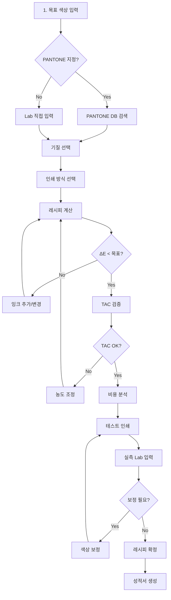

# 🎨 잉크 레시피 계산기 v3.1 전문가 검토 보고서

## 📋 목차
1. [시스템 현황 분석](#1-시스템-현황-분석)
2. [컬러리스트 관점 평가](#2-컬러리스트-관점-평가)
3. [인쇄 실무자 관점 평가](#3-인쇄-실무자-관점-평가)
4. [라벨 기획자 관점 평가](#4-라벨-기획자-관점-평가)
5. [핵심 개선사항](#5-핵심-개선사항)
6. [실무 워크플로우 제안](#6-실무-워크플로우-제안)

---

## 1. 시스템 현황 분석

### ✅ 구현된 기능

#### 1.1 색상 입력 및 관리
- **Lab 값 직접 입력** (음수 지원 완료)
- **PANTONE 데이터베이스** (D50/2° 기준)
- **다중 색공간 표시** (RGB, CMYK, HSV, HSL, HEX)
- **PANTONE 근사 매칭** (Delta E 기반 3개 추천)

#### 1.2 잉크 레시피 계산
- **기본 프로세스 잉크** (CMYK + White)
- **스팟 컬러** (Orange, Green, Violet, Red, Blue)
- **메탈릭 잉크** (Silver, Gold, Bronze)
- **농도별 Lab 값** (100%, 70%, 40%)
- **선형 보간** 농도 계산

#### 1.3 색상 보정 기능
- **Delta E 2000** 색차 계산
- **보정 방향 분석** (명도, 적녹, 황청)
- **보정 가능성 평가**
- **특수 잉크 추천**
- **보정 이력 관리**

#### 1.4 품질 관리
- **TAC (Total Area Coverage)** 제한 검증
- **프린터 프로파일** (Offset, Flexo, Digital)
- **성적서 생성** 기능
- **색차 허용 기준** 설정 (ΔE < 1.5 목표)

---

## 2. 컬러리스트 관점 평가

### 💪 강점
1. **D50/2° 표준 준수** - 인쇄 업계 표준 정확히 적용
2. **Delta E 2000** - 최신 색차 공식 사용
3. **농도별 Lab 값** - Satin 인쇄 대응 가능
4. **색상 보정 알고리즘** - 실무 활용 가능 수준

### ⚠️ 문제점
1. **잉크 혼합 예측 정확도**
   - 현재: 선형 혼합 가정
   - 실제: 비선형 상호작용 발생
   
2. **특수 효과 미지원**
   - 형광 잉크 Lab 값 부재
   - 펄/메탈릭 각도별 측정값 없음
   
3. **기질(Substrate) 영향 무시**
   - 종이 색상/질감 미반영
   - 잉크 흡수율 차이 무시

### 🔧 개선 제안
```javascript
// 1. 비선형 혼합 모델 추가
const nonLinearMixing = {
  // Kubelka-Munk 이론 적용
  K_S_calculation: (reflectance) => {
    return (1 - reflectance) ** 2 / (2 * reflectance);
  },
  
  // 잉크 상호작용 계수
  interactionFactors: {
    'cyan-magenta': 0.95,  // 약간의 탁도 증가
    'yellow-black': 0.88,   // 명도 감소 가속
    'cyan-yellow': 1.02     // 녹색 채도 증가
  }
};

// 2. 기질 프로파일 추가
const substrateProfiles = {
  'coated_gloss': { L: 95, a: 0, b: -2, absorption: 0.15 },
  'uncoated_matt': { L: 92, a: 0, b: 2, absorption: 0.35 },
  'kraft': { L: 75, a: 3, b: 15, absorption: 0.45 },
  'metallic_film': { L: 88, a: 0, b: 0, absorption: 0.05 }
};
```

---

## 3. 인쇄 실무자 관점 평가

### 💪 강점
1. **TAC 제한 관리** - 인쇄기별 한계 고려
2. **프린터 프로파일** - Offset/Flexo/Digital 구분
3. **실시간 보정** - 현장 조정 가능
4. **성적서 생성** - 품질 문서화

### ⚠️ 문제점
1. **점 게인(Dot Gain) 보정 부족**
   - 현재: 고정값 사용
   - 필요: 농도별 가변 보정
   
2. **인쇄 조건 변수 부족**
   - 인쇄 속도 영향 무시
   - 잉크 점도/온도 미반영
   - 스크린 각도/선수 정보 없음

3. **건조 특성 미고려**
   - UV/열건조 차이
   - 오버프린트 시간 간격

### 🔧 개선 제안
```javascript
// 1. 동적 Dot Gain 보정
const dotGainCurves = {
  offset: {
    10: 15,  // 10% → 25%
    25: 18,  // 25% → 43%
    50: 22,  // 50% → 72%
    75: 15,  // 75% → 90%
    90: 8    // 90% → 98%
  },
  flexo: {
    10: 20,
    25: 25,
    50: 28,
    75: 20,
    90: 10
  }
};

// 2. 인쇄 조건 매개변수
const printingConditions = {
  speed: 8000,  // sheets/hour
  temperature: 25,  // °C
  humidity: 55,  // %
  inkViscosity: {
    cyan: 18,  // Pa·s
    magenta: 18,
    yellow: 17,
    black: 19
  },
  screenRuling: 175,  // lpi
  screenAngles: {
    cyan: 15,
    magenta: 75,
    yellow: 0,
    black: 45
  }
};

// 3. 트래핑(Trapping) 설정
const trappingSettings = {
  defaultWidth: 0.1,  // mm
  blackWidth: 0.15,
  colorOrder: ['yellow', 'magenta', 'cyan', 'black'],
  chokeOrSpread: 'spread'  // lighter color spreads
};
```

---

## 4. 라벨 기획자 관점 평가

### 💪 강점
1. **브랜드 색상 관리** - PANTONE 정확도
2. **비용 최적화 가능** - 최소 잉크 사용
3. **다양한 인쇄 방식 지원**
4. **이력 추적** - 품질 관리

### ⚠️ 문제점
1. **비용 계산 없음**
   - 잉크별 단가 미반영
   - 특수 잉크 프리미엄 무시
   
2. **생산성 지표 부재**
   - 색상 전환 시간
   - 세척 횟수 최소화
   
3. **규제 준수 체크 없음**
   - 식품 안전 잉크 구분
   - 환경 인증 요구사항

### 🔧 개선 제안
```javascript
// 1. 비용 최적화 모듈
const costOptimization = {
  inkPrices: {  // $/kg
    cyan: 12,
    magenta: 15,
    yellow: 10,
    black: 8,
    white: 20,
    orange: 35,
    green: 32,
    metallic: 85
  },
  
  calculateRecipeCost: (recipe) => {
    let totalCost = 0;
    recipe.inks.forEach(ink => {
      const price = inkPrices[ink.inkId];
      const usage = ink.ratio * 0.015;  // g/m²
      totalCost += price * usage / 1000;
    });
    return totalCost;
  },
  
  optimizeForCost: (targetLab, maxDeltaE = 2.0) => {
    // 허용 색차 내에서 최저 비용 레시피 탐색
  }
};

// 2. 생산 효율성 분석
const productionEfficiency = {
  colorChangeMatrix: {  // 분 단위 전환 시간
    'CMYK': { 'CMYK': 0, 'Spot': 15, 'Metallic': 25 },
    'Spot': { 'CMYK': 20, 'Spot': 10, 'Metallic': 30 },
    'Metallic': { 'CMYK': 35, 'Spot': 35, 'Metallic': 15 }
  },
  
  batchOptimization: (jobs) => {
    // 색상 전환 최소화 작업 순서 최적화
    // Traveling Salesman Problem 변형
  }
};

// 3. 규제 준수 체크리스트
const complianceCheck = {
  foodSafe: ['cyan_fs', 'magenta_fs', 'yellow_fs', 'black_fs'],
  lowMigration: ['lm_cyan', 'lm_magenta', 'lm_yellow', 'lm_black'],
  certifications: {
    'FDA': true,
    'EU_10_2011': true,
    'Nestle_Guidance': true,
    'ISO_14001': true
  }
};
```

---

## 5. 핵심 개선사항

### 🚨 즉시 개선 필요

1. **잉크 데이터베이스 확장**
```javascript
// 실무 필수 잉크 추가
const additionalInks = {
  // Reflex Blue (브랜드 로고 필수)
  reflexBlue: {
    id: 'reflex_blue',
    name: 'Reflex Blue C',
    L: 25.89, a: 20.75, b: -66.42,
    concentrations: {
      100: { L: 25.89, a: 20.75, b: -66.42 },
      70: { L: 38.5, a: 14.5, b: -46.5 },
      40: { L: 52.3, a: 8.3, b: -26.6 }
    }
  },
  
  // Warm Red (식품 라벨 빈출)
  warmRed: {
    id: 'warm_red',
    name: 'Warm Red C',
    L: 51.24, a: 66.89, b: 52.41,
    concentrations: {
      100: { L: 51.24, a: 66.89, b: 52.41 },
      70: { L: 63.2, a: 46.8, b: 36.7 },
      40: { L: 74.5, a: 26.8, b: 21.0 }
    }
  },
  
  // Transparent White (농도 조절용)
  transWhite: {
    id: 'trans_white',
    name: 'Transparent White',
    opacity: 0,
    effect: 'dilution'
  }
};
```

2. **스마트 레시피 제안**
```javascript
class SmartRecipeSuggestion {
  suggestAlternatives(targetLab, constraints) {
    const alternatives = [];
    
    // 1. 최소 잉크 수 레시피
    alternatives.push({
      name: '최소 잉크',
      recipe: this.minimumInksRecipe(targetLab),
      pros: '색상 안정성, 관리 용이',
      cons: '제한된 색역'
    });
    
    // 2. 최저 비용 레시피
    alternatives.push({
      name: '경제적',
      recipe: this.lowestCostRecipe(targetLab),
      pros: '비용 절감',
      cons: '특수 잉크 배제'
    });
    
    // 3. 최고 정확도 레시피
    alternatives.push({
      name: '고정밀',
      recipe: this.highestAccuracyRecipe(targetLab),
      pros: 'ΔE < 1.0 달성',
      cons: '복잡도 증가'
    });
    
    return alternatives;
  }
}
```

3. **실시간 피드백 시스템**
```javascript
class RealTimeFeedback {
  constructor() {
    this.warningThresholds = {
      TAC: 320,
      inkCount: 6,
      deltaE: 2.0,
      cost: 0.5  // $/m²
    };
  }
  
  validateRecipe(recipe) {
    const warnings = [];
    const errors = [];
    
    // TAC 체크
    const tac = recipe.inks.reduce((sum, ink) => sum + ink.ratio, 0);
    if (tac > this.warningThresholds.TAC) {
      errors.push(`TAC 초과: ${tac}% (한계: ${this.warningThresholds.TAC}%)`);
    }
    
    // 잉크 수 체크
    if (recipe.inks.length > this.warningThresholds.inkCount) {
      warnings.push(`잉크 수 과다: ${recipe.inks.length}개 (권장: ≤6)`);
    }
    
    // 특수 조합 경고
    if (this.hasProblematicCombination(recipe)) {
      warnings.push('주의: 이 조합은 메타메리즘 위험이 있습니다');
    }
    
    return { warnings, errors, canProceed: errors.length === 0 };
  }
}
```

---

## 6. 실무 워크플로우 제안

### 📊 최적 작업 순서



### 🎯 핵심 체크포인트

1. **색상 지정 단계**
   - [ ] 조명 조건 확인 (D50)
   - [ ] 기질 색상 측정
   - [ ] 브랜드 가이드라인 확인

2. **레시피 계산 단계**
   - [ ] ΔE < 1.5 달성
   - [ ] TAC < 인쇄기 한계
   - [ ] 비용 < 예산

3. **검증 단계**
   - [ ] 3회 이상 재현성 테스트
   - [ ] 다른 조명 하 색상 확인
   - [ ] 내광성/내마모성 테스트

4. **문서화**
   - [ ] 레시피 기록
   - [ ] 인쇄 조건 기록
   - [ ] 품질 성적서 발행

---

## 🎯 결론 및 권장사항

### 현재 시스템 평가
- **기본 기능**: ★★★★☆ (우수)
- **실무 적용성**: ★★★☆☆ (보통)
- **확장 가능성**: ★★★★☆ (우수)

### 우선순위 개선사항
1. **즉시**: 잉크 DB 확장, 비선형 혼합 모델
2. **단기**: 비용 최적화, 기질 프로파일
3. **중기**: 생산 효율성, 규제 준수
4. **장기**: AI 기반 예측, 클라우드 연동

### 최종 제언
현재 시스템은 **기초는 탄탄**하나 **실무 디테일이 부족**합니다.
위 개선사항을 단계적으로 적용하면 **산업 표준 수준**의 
전문 잉크 배합 시스템으로 발전할 수 있습니다.

특히 **비선형 혼합 모델**과 **기질 영향 반영**은 
색상 정확도를 크게 향상시킬 핵심 요소입니다.